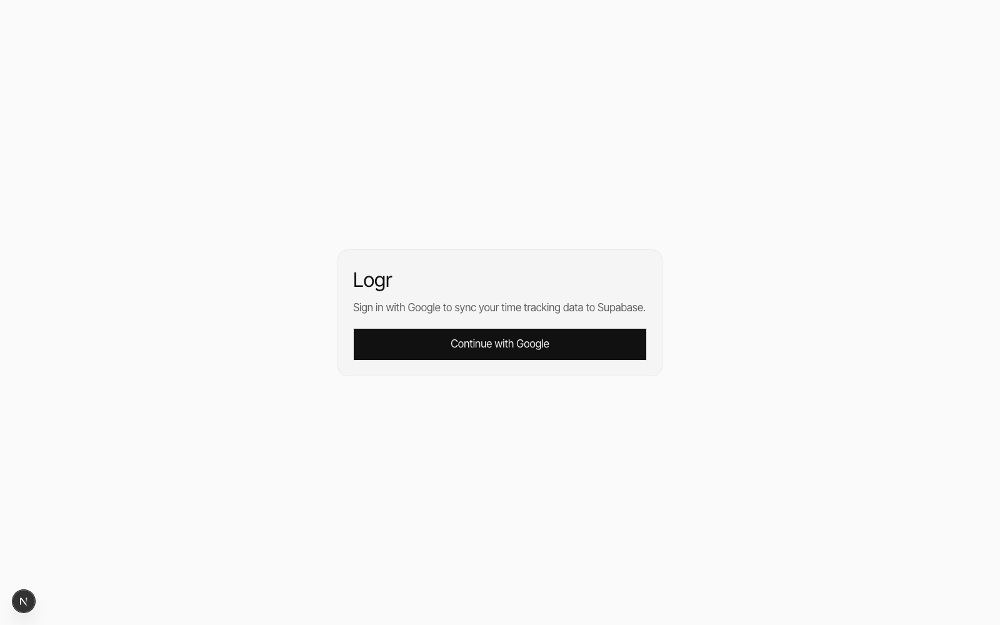

# Logr

Freelance time tracker + CRM with Google sign-in, cloud sync in Supabase, and invoice exports.

## Preview (Personal Cabinet)

Preview of the tracker workspace at `/tracker`:



## What it does

- Landing page at `/`
- Tracker app at `/tracker`
- Clients → Projects → Sessions workflow
- Session types: `hourly` and `fixed_project`
- Session statuses: `PENDING`, `ACTIVE`, `DONE`
- Payment status tracking: `UNPAID` / `PAID`
- Dashboard metrics (money, hours, avg rate, collection %, pricing health, trends)
- Profile settings for default rate, workday hours, and fixed-task rules
- CSV export and printable PDF invoice (via browser print dialog)
- Light/dark theme and mobile-friendly layout

### CRM features

- **Client cards** — email, phone, website, country, tags, notes + revenue summary per client
- **Pipeline Kanban** — 5 stages (Lead → Negotiation → Contract → Active → Done), drag-and-drop between columns, estimated value totals per column
- **Invoices** — DB-backed invoices built from DONE sessions: 4-step wizard, tax rate, due date, PDF print via `window.print`, status lifecycle (Draft → Sent → Paid), overdue badge

## Tech stack

- Next.js 16 (App Router)
- React 19
- Supabase Auth (Google OAuth)
- Supabase Postgres (JSONB `user_app_state` + 3 relational CRM tables + RLS)
- dnd-kit (drag-and-drop for Pipeline Kanban)
- Vercel Analytics + Speed Insights

## Requirements

- Node.js 20+
- npm
- Supabase project
- Google OAuth credentials (for auth provider)

## Quick start

```bash
npm install
cp .env.example .env.local
npm run dev
```

Open [http://localhost:3000](http://localhost:3000).

## Environment variables

Create `.env.local`:

```bash
NEXT_PUBLIC_SUPABASE_URL=...
NEXT_PUBLIC_SUPABASE_ANON_KEY=...
```

## Supabase setup

1. Create a Supabase project.
2. Run SQL from `supabase/schema.sql` in the Supabase SQL Editor.
3. Run migrations from `supabase/migrations/` in order.
4. In Supabase Auth → Providers, enable Google and add OAuth client ID/secret.
5. In Supabase Auth URL settings, add redirect URLs:
   - `http://localhost:3000`
   - your production URL
6. Copy project values to `.env.local`:
   - Project URL → `NEXT_PUBLIC_SUPABASE_URL`
   - Project API anon key → `NEXT_PUBLIC_SUPABASE_ANON_KEY`

## Database shape

### `public.user_app_state` (JSONB, untouched)

```sql
user_id  uuid primary key references auth.users(id) on delete cascade
clients  jsonb not null default '[]'
sessions jsonb not null default '[]'
settings jsonb not null
```

### `public.client_profiles` (CRM extra fields)

```sql
id        uuid primary key
user_id   uuid references auth.users(id)
client_id text  -- matches JSONB client id
email, phone, website, country  text
tags      text[] default '{}'
notes     text
```

### `public.leads` (Pipeline Kanban)

```sql
id               uuid primary key
user_id          uuid references auth.users(id)
name, company    text
stage            text  -- lead | negotiation | contract | active | done
estimated_value  numeric(12,2)
currency         text default 'USD'
email, phone, website, country, source, notes  text
tags             text[] default '{}'
```

### `public.invoices`

```sql
id              uuid primary key
user_id         uuid references auth.users(id)
client_id       text
client_name     text
invoice_number  text
issue_date      date
due_date        date
currency        text default 'USD'
items           jsonb default '[]'
subtotal, tax_rate, tax_amount, total  numeric
status          text  -- draft | sent | paid | overdue | cancelled
session_ids     text[] default '{}'
notes           text
```

All tables use RLS: rows are restricted to `auth.uid() = user_id`.

## Migrations

SQL migrations are in `supabase/migrations/`:

| File | Description |
|------|-------------|
| `20260223153000_add_settings_to_user_app_state.sql` | Add `settings` column |
| `20260223184000_add_require_project_for_fixed_setting.sql` | Backfill `requireProjectForFixed` |
| `20260223193000_add_target_hourly_rate_setting.sql` | Backfill `targetHourlyRate` |
| `20260223202000_default_payment_status_unpaid.sql` | Backfill session `paymentStatus` |
| `20260227120000_add_crm_tables.sql` | Add `client_profiles`, `leads`, `invoices` |

For a fresh project, applying `schema.sql` + the CRM migration is enough.

## Scripts

```bash
npm run dev
npm run lint
npm run build
npm run start
```

## Keyboard shortcut

- `Space`: start/stop active hourly timer (outside input fields)

## Notes

- If Supabase env vars are missing, the tracker shows a setup screen.
- JSONB state (clients, sessions, settings) is synced to Supabase with a 500ms debounce and cached in `sessionStorage` for faster reloads.
- CRM data (client profiles, leads, invoices) is written directly to Supabase on each mutation — no debounce.

## License

Apache License 2.0. See `LICENSE` and `NOTICE`.
