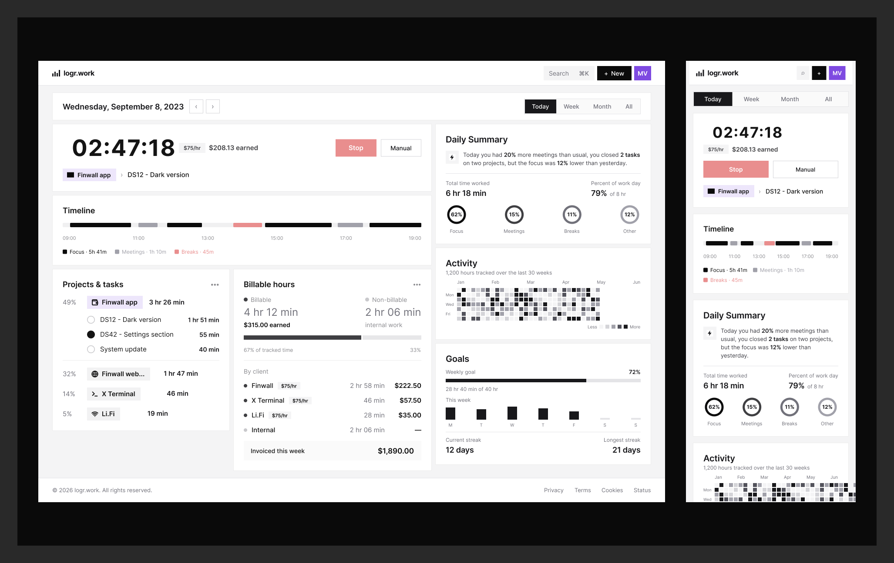

# Logr

**Open-source, self-hostable Toggl alternative — with built-in invoicing.** Track time, bill clients, and get paid from one fast single-screen dashboard. Built with Next.js, React 19, and Supabase.

[](https://logr.work)  [](LICENSE) 

**[▶ Try the live demo](https://logr.work)** &nbsp;·&nbsp; [Deploy your own](#getting-started) &nbsp;·&nbsp; [Self-host](#self-host--deploy-docker)

[](https://vercel.com/new/clone?repository-url=https://github.com/zerox9dev/logr)



## Features

- ⏱️ **Timer** — Start/stop tracking with one click. Manual entries, plus bulk import of time entries from CSV.
- ✨ **Smart project suggestions** — as you describe what you're working on, Logr suggests the matching project (and applies its rate/billing) with one click. Works offline from your own history; optionally sharpened by Claude when you set `ANTHROPIC_API_KEY`.
- 📁 **Projects & Clients** — Organize work by client; hourly or fixed-budget billing.
- 💸 **Billing** — Per-session and per-project rates, paid/unpaid status, billable vs total time.
- 🧾 **Invoicing** — Build an invoice from a client's unbilled sessions (optional tax & due date), track draft/sent/paid/overdue status, and share a public invoice link.
- 📊 **Dashboard widgets** — Daily summary, billable hours, tracking card, goals, projects & tasks, timeline.
- 📈 **Activity heatmap** — GitHub-style graph of your work history.
- 🔗 **Shareable links** — Self-contained report and invoice links (encoded in the URL).
- 🔌 **MCP server** — manage Logr from any MCP-compatible AI assistant (Claude, etc.): list/create/update/delete clients, projects, time entries, and invoices, plus dashboard summaries — all over a remote MCP endpoint, scoped to your account.
- 💬 **In-app AI assistant** — a chat panel that drives the **same** tools as the MCP server (one shared registry): "show unbilled for Acme and draft an invoice." Reads and edits run inline; destructive actions (deletes) require an explicit confirm. Needs `ANTHROPIC_API_KEY`.
- 🔐 **Auth** — Google OAuth **and** passwordless email magic links, via Supabase.
- 🌍 **i18n** — App UI in English, Ukrainian, and Russian (auto-detected).

## Why Logr?

Most time trackers stop at "track" and make you bolt on a separate invoicing tool. Logr closes the loop — **track → bill → get paid** — and you own the data.

| | Logr | Toggl | Harvest | Clockify |
|---|:---:|:---:|:---:|:---:|
| Open source | ✅ | ❌ | ❌ | ❌ |
| Self-hostable | ✅ | ❌ | ❌ | ❌ |
| Time tracking | ✅ | ✅ | ✅ | ✅ |
| Invoicing built-in | ✅ | ❌ (add-on) | ✅ | ➖ |
| Shareable report/invoice links | ✅ | ➖ | ✅ | ➖ |
| Single-screen, no page reloads | ✅ | ❌ | ❌ | ❌ |
| Free forever (self-host) | ✅ | ❌ | ❌ | ➖ |

## Stack

- [Next.js 16](https://nextjs.org) (App Router) + [React 19](https://react.dev) + TypeScript
- [Tailwind CSS v4](https://tailwindcss.com) + [shadcn/ui](https://ui.shadcn.com) (Radix primitives, CVA) + [lucide-react](https://lucide.dev) icons
- [Supabase](https://supabase.com) — Postgres, Auth, Row-Level Security — via `@supabase/ssr` (cookie-based SSR sessions)
- [Vitest](https://vitest.dev) + Testing Library — unit tests
- `mcp-handler` (MCP server adapter) — hosted MCP endpoint at `/mcp`
- `@vercel/analytics` + `@vercel/speed-insights` — Vercel Analytics & Speed Insights (mounted in root layout)
- Deployed on [Vercel](https://vercel.com)

## Getting Started

```bash
git clone https://github.com/zerox9dev/logr.git && cd logr && npm install
```

Create `.env.local`:

```
NEXT_PUBLIC_SUPABASE_URL=https://your-project.supabase.co
NEXT_PUBLIC_SUPABASE_ANON_KEY=eyJ...
SUPABASE_SERVICE_ROLE_KEY=eyJ...
ANTHROPIC_API_KEY=sk-ant-...   # optional — AI assistant + LLM-backed project suggestions
```

> `SUPABASE_SERVICE_ROLE_KEY` is server-only and never exposed to the browser.
> `ANTHROPIC_API_KEY` is optional and server-only: it powers the in-app AI assistant and sharpens project suggestions. Without it, project suggestions still work from your local history and the assistant is disabled.

Run the dev server:

```bash
npm run dev
```

Open [http://localhost:3000](http://localhost:3000).

## Self-host / deploy (Docker)

logr is a Next.js app backed by Supabase. Run the app anywhere with Docker and point it at **your own Supabase** — either [Supabase Cloud](https://supabase.com) (free tier is plenty) or a [self-hosted Supabase](https://supabase.com/docs/guides/self-hosting/docker). Keeping Supabase separate means you get its battle-tested auth, Postgres, and RLS without bundling a fragile ten-container stack.

### 1 — Create a Supabase project and apply the schema

Create a project (Cloud or self-hosted), then run the schema migration to create the tables, enums, and RLS policies:

- **SQL editor:** paste the contents of [`supabase/migrations/0001_init.sql`](supabase/migrations/0001_init.sql) and run it, **or**
- **Supabase CLI:** `supabase link --project-ref <ref> && supabase db push`

Then enable auth providers under *Authentication → Providers* (Email for magic links; Google optional) and add your redirect URLs — see [Supabase setup](#supabase-setup) below.

### 2 — Configure and run the app

```bash
git clone https://github.com/zerox9dev/logr.git && cd logr
cp .env.example .env       # fill in the 3 values from Project Settings → API
docker compose up -d --build
```

`.env` needs three values from your Supabase dashboard (*Project Settings → API*), plus one optional key:

```
NEXT_PUBLIC_SUPABASE_URL=https://<project-ref>.supabase.co
NEXT_PUBLIC_SUPABASE_ANON_KEY=eyJ...          # anon public key
SUPABASE_SERVICE_ROLE_KEY=eyJ...              # service_role key (server-only)
ANTHROPIC_API_KEY=sk-ant-...                  # optional — AI assistant + project suggestions
```

The app comes up at **http://localhost:3000**. Optional `.env` knobs: `APP_PORT` (change the host port) and `SUPABASE_INTERNAL_URL` (only if the container reaches Supabase at a different address than the browser — e.g. a self-hosted Supabase on the same Docker network). See [`.env.example`](.env.example).

> `NEXT_PUBLIC_*` are baked into the client bundle at build time — if you change them, rebuild with `docker compose up -d --build`.

Prefer a one-click deploy? Use the [Deploy with Vercel](https://vercel.com/new/clone?repository-url=https://github.com/zerox9dev/logr) button at the top — same three env vars.

### Stop / clean up

```bash
docker compose down     # stop the app container
```

---

## Scripts

| Command | Description |
|---------|-------------|
| `npm run dev` | Next dev server |
| `npm run build` | Production build (`next build`) |
| `npm run start` | Serve the production build |
| `npm run lint` | ESLint (`eslint-config-next`) |
| `npm run typecheck` | `tsc --noEmit` |
| `npm run test` | Vitest |
| `npm run check` | `typecheck` → `lint` → `test` → `build` (run before pushing) |

## Project Structure

```
src/
├── app/                    # Next App Router
│   ├── layout.tsx / page.tsx / providers.tsx / globals.css
│   ├── login/              # Auth page
│   ├── app/                # Dashboard (auth-gated)
│   ├── share/              # Public shared report & invoice links
│   ├── auth/callback/      # OAuth / magic-link code exchange
│   ├── [transport]/        # MCP server endpoint (Streamable HTTP + SSE)
│   ├── oauth/consent/      # OAuth consent screen for MCP authorization
│   ├── alternatives/toggl/ # Public SEO landing — open-source Toggl alternative
│   ├── privacy/            # Privacy policy
│   ├── terms/              # Terms of service
│   └── .well-known/oauth-protected-resource/  # OAuth 2.1 auto-discovery
├── api/            # Supabase CRUD + auth helpers
├── components/     # ui/ (shadcn primitives), shared/, dashboard/ (+ widgets/), layout/, auth/
├── contexts/       # auth, data, dashboard providers
├── hooks/          # use-data, use-timer
├── domain/         # pure logic + tests: dashboard-metrics, report-share, invoicing, invoice-share
├── i18n/           # provider + en/uk/ru dictionaries
├── lib/            # supabase (browser) + supabase-server + supabase-mcp (server client +
│                   # token verification for MCP) + supabase-url (server URL resolver),
│                   # format, date, base64, clipboard, utils
├── proxy.ts        # Next.js proxy (the v16 rename of middleware): session refresh + /app auth gate
└── types/          # database types
```

**Routes:**

| Route | Description |
|-------|-------------|
| `/` | Public SSR marketing landing |
| `/login` | Auth — Google OAuth + email magic link |
| `/app` | Dashboard (auth-gated via proxy + server session check) |
| `/share/report`, `/share/invoice` | Public read-only shared links (data encoded in URL) |
| `/auth/callback` | OAuth / magic-link code exchange |
| `/mcp` (+ `/sse`) | Hosted MCP server endpoint (OAuth-protected) |
| `/api/chat` | In-app AI assistant — server-side tool-use loop over the shared MCP tool registry |
| `/api/suggest` | LLM fallback for project suggestions (history-first; null without an API key) |
| `/oauth/consent` | OAuth consent screen for the MCP authorization flow |
| `/alternatives/toggl` | Public SEO comparison/landing page — open-source Toggl alternative |
| `/privacy`, `/terms` | Legal pages |

`/` and `/share/*` are server-rendered; `/app` is a client dashboard behind the auth gate.

## Supabase Setup

1. Create a project at [supabase.com](https://supabase.com).
2. Run the SQL migrations to create the tables (clients, projects, sessions, invoices, invoice_items, activities, user_settings) and enums.
3. **Enable auth providers** under *Authentication → Providers*:
   - **Email** — turn on email sign-ups to allow magic links (no SMTP setup needed for development; configure a custom SMTP for production).
   - **Google** — add your Google OAuth Client ID & Secret, and set the redirect URI in the Google Console to `https://<project>.supabase.co/auth/v1/callback`.
4. Under *Authentication → URL Configuration*, add the following to the **Redirect URLs** allow-list:
   - `http://localhost:3000/auth/callback` (local dev)
   - `https://<your-domain>/auth/callback` (production)

All tables use Row-Level Security with `user_id = auth.uid()`.

**MCP server:** to use the MCP endpoint, enable the Supabase **OAuth 2.1 Server** with **Dynamic Client Registration** under *Authentication → OAuth Server*, and set the Authorization Path to `/oauth/consent`.

## MCP (AI assistant access)

Logr exposes a hosted [Model Context Protocol](https://modelcontextprotocol.io) server at `https://logr.work/mcp` (Streamable HTTP; SSE variant at `/sse`).

**Auth:** standard MCP OAuth 2.1 via Supabase — modern clients auto-discover the flow and prompt you to log in; no token copy-pasting needed. All tools run scoped to your account via Row-Level Security.

**What you can do:** full CRUD over clients, projects, time entries (sessions), and invoices, plus `dashboard_summary`, `recent_sessions`, and `list_unbilled` insight tools — 18 tools total. See [docs/MCP.md](docs/MCP.md) for the complete list.

**Claude Desktop config example (OAuth auto-discovery):**

```json
{
  "mcpServers": {
    "logr": {
      "url": "https://logr.work/mcp"
    }
  }
}
```

See [docs/MCP.md](docs/MCP.md) for OAuth setup steps and manual bearer token instructions (useful for testing).

## Contributing

Issues, feature ideas, and PRs are welcome — see [CONTRIBUTING.md](CONTRIBUTING.md). If Logr is useful to you, a ⭐ helps others find it.

## License

[AGPL-3.0](LICENSE)

---

Built by [@zerox9dev](https://zerox9dev.com)
