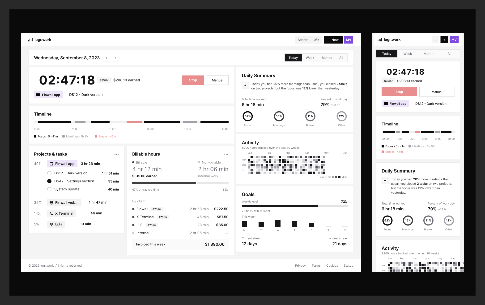

# Logr

**Open-source, self-hostable Toggl alternative — with built-in invoicing.** Track time, bill clients, and get paid from one fast single-screen dashboard. Built with Next.js, React 19, and PocketBase.

[](https://logr.work)  [](LICENSE) 

**[▶ Try the live demo](https://logr.work)** &nbsp;·&nbsp; [Deploy your own](#getting-started) &nbsp;·&nbsp; [Self-host](#self-host--deploy-docker)

[](https://vercel.com/new/clone?repository-url=https://github.com/zerox9dev/logr)



## Features

- ⏱️ **Timer** — Start/stop tracking with one click. Manual entries, plus bulk import of time entries from CSV.
- ✨ **Smart project suggestions** — as you describe what you're working on, Logr suggests the matching project (and applies its rate/billing) with one click. Works offline from your own history; optionally sharpened by Claude when you set `ANTHROPIC_API_KEY`.
- 📁 **Projects & Clients** — Organize work by client; hourly or fixed-budget billing.
- 💸 **Billing** — Per-session and per-project rates, paid/unpaid status, billable vs total time.
- 🧾 **Invoicing** — Build an invoice from a client's unbilled sessions (optional tax & due date), track draft/sent/paid/overdue status, and share a public invoice link.
- 📊 **Dashboard widgets** — Daily summary, billable hours, tracking card, goals, projects & tasks, timeline.
- 📈 **Activity heatmap** — GitHub-style graph of your work history.
- 🔗 **Shareable links** — Self-contained report and invoice links (encoded in the URL).
- 💬 **In-app AI assistant** — a chat panel over the shared tool registry: "show unbilled for Acme and draft an invoice." Reads and edits run inline; destructive actions (deletes) require an explicit confirm. Needs `ANTHROPIC_API_KEY`.
- 🔐 **Auth** — email + password sign-up and sign-in with a password-reset flow, via PocketBase.
- 🌍 **i18n** — App UI in English, Ukrainian, and Russian (auto-detected).

## Why Logr?

Most time trackers stop at "track" and make you bolt on a separate invoicing tool. Logr closes the loop — **track → bill → get paid** — and you own the data.

| | Logr | Toggl | Harvest | Clockify |
|---|:---:|:---:|:---:|:---:|
| Open source | ✅ | ❌ | ❌ | ❌ |
| Self-hostable | ✅ | ❌ | ❌ | ❌ |
| Time tracking | ✅ | ✅ | ✅ | ✅ |
| Invoicing built-in | ✅ | ❌ (add-on) | ✅ | ➖ |
| Shareable report/invoice links | ✅ | ➖ | ✅ | ➖ |
| Single-screen, no page reloads | ✅ | ❌ | ❌ | ❌ |
| Free forever (self-host) | ✅ | ❌ | ❌ | ➖ |

## Stack

- [Next.js 16](https://nextjs.org) (App Router) + [React 19](https://react.dev) + TypeScript
- [Tailwind CSS v4](https://tailwindcss.com) + [shadcn/ui](https://ui.shadcn.com) (Radix primitives, CVA) + [lucide-react](https://lucide.dev) icons
- [PocketBase](https://pocketbase.io) — database, auth, and API Rules — reached server-side only, via Server Actions and the `pocketbase` JS SDK
- [MDX](https://mdxjs.com) via `@next/mdx` — blog articles, styled with the app's Tailwind tokens (no prose plugin)
- [Vitest](https://vitest.dev) + Testing Library — unit tests
- `@vercel/analytics` + `@vercel/speed-insights` — Vercel Analytics & Speed Insights (mounted in root layout)
- Deployed on [Vercel](https://vercel.com)

## Getting Started

```bash
git clone https://github.com/zerox9dev/logr.git && cd logr && npm install
```

Create `.env.local`:

```
POCKETBASE_URL=http://127.0.0.1:8090
ANTHROPIC_API_KEY=sk-ant-...   # optional — AI assistant + LLM-backed project suggestions
```

> `POCKETBASE_URL` is server-only and never exposed to the browser — the app talks to PocketBase exclusively from Server Actions and route handlers, so PocketBase can live on a private network.
> `ANTHROPIC_API_KEY` is optional and server-only: it powers the in-app AI assistant and sharpens project suggestions. Without it, project suggestions still work from your local history and the assistant is disabled.

Run the dev server:

```bash
npm run dev
```

Open [http://localhost:3000](http://localhost:3000).

## Self-host / deploy (Docker)

logr is a Next.js app backed by PocketBase. `docker compose up` runs both: the app and a PocketBase instance on the same Docker network. Because only the server talks to PocketBase, it never needs a public hostname — the internal `pocketbase` alias is enough.

### 1 — Start the stack

```bash
git clone https://github.com/zerox9dev/logr.git && cd logr
cp .env.example .env
docker compose up -d --build
```

`.env` needs no edits to run locally; the keys are optional:

```
POCKETBASE_URL=http://pocketbase:8090         # server-only, defaults to the bundled service
ANTHROPIC_API_KEY=sk-ant-...                  # optional — AI assistant + project suggestions
PB_ADMIN_EMAIL=admin@logr.local               # superuser created on first boot
PB_ADMIN_PASSWORD=changeme_please_1234        # change before exposing the instance
```

### 2 — Sign in to the admin UI

The schema applies itself: `pb_migrations/` is mounted into the container and PocketBase runs any un-applied migration on start, so all nine collections and their API rules exist the moment the container reports healthy. The superuser is created from `PB_ADMIN_EMAIL` / `PB_ADMIN_PASSWORD`.

Open the PocketBase admin UI at **http://localhost:8090/_/** and sign in with those credentials. Schema changes made there are written back into `pb_migrations/` as new files — commit them.

The app comes up at **http://localhost:3000**. Optional `.env` knobs: `APP_PORT` and `POCKETBASE_PORT` (change the host ports). See [`.env.example`](.env.example).

> `POCKETBASE_URL` is read at runtime, so changing it needs a container restart — never a rebuild.

> **Production.** The bundled PocketBase is fine for local dev and small self-hosts, but its data lives in a single `pocketbase_data` Docker volume and backups are yours to handle. For anything you care about, run your own managed or otherwise persistent PocketBase and point `POCKETBASE_URL` at it.

Prefer a one-click deploy? Use the [Deploy with Vercel](https://vercel.com/new/clone?repository-url=https://github.com/zerox9dev/logr) button at the top — with a PocketBase instance Vercel can reach.

### Stop / clean up

```bash
docker compose down     # stop the containers; the pocketbase_data volume is kept
```

To drop the database too: `docker compose down -v`.

---

## Scripts

| Command | Description |
|---------|-------------|
| `npm run dev` | Next dev server |
| `npm run build` | Production build (`next build`) |
| `npm run start` | Serve the production build |
| `npm run lint` | ESLint (`eslint-config-next`) |
| `npm run typecheck` | `tsc --noEmit` |
| `npm run test` | Vitest |
| `npm run check` | `typecheck` → `lint` → `test` → `build` (run before pushing) |

## Project Structure

```
src/
├── app/                    # Next App Router
│   ├── layout.tsx / page.tsx / providers.tsx / globals.css
│   ├── login/              # Auth page
│   ├── app/                # Dashboard (auth-gated)
│   ├── share/              # Public shared report & invoice links
│   ├── reset-password/     # Password-reset confirmation (PocketBase token link)
│   ├── alternatives/       # SEO hub + /[competitor] comparison pages (data-driven)
│   ├── blog/               # Blog index + /[slug] MDX articles + /rss.xml
│   ├── privacy/            # Privacy policy
│   └── terms/              # Terms of service
├── actions/        # Server Actions: auth + per-resource CRUD (the whole data layer)
├── api/            # agent-tools: shared tool registry for the in-app assistant
├── content/blog/   # Blog articles as MDX (body only; metadata lives in data/posts.ts)
├── data/           # Static content sources: competitors.ts, posts.ts
├── mdx-components.tsx  # MDX element → Tailwind token mapping for blog articles
├── components/     # ui/ (shadcn primitives), shared/, dashboard/ (+ widgets/), layout/, auth/
├── contexts/       # auth, data, dashboard providers
├── hooks/          # use-data, use-timer
├── domain/         # pure logic + tests: dashboard-metrics, report-share, invoicing, invoice-share
├── i18n/           # provider + en/uk/ru dictionaries
├── lib/            # pocketbase (client factory + helpers), pocketbase-server (session from
│                   # cookies), pocketbase-mappers (records ↔ row types),
│                   # format, date, base64, clipboard, utils
├── proxy.ts        # Next.js proxy (the v16 rename of middleware): /app auth gate
└── types/          # database types
```

**Routes:**

| Route | Description |
|-------|-------------|
| `/` | Public SSR marketing landing |
| `/login` | Auth — email + password sign-in, account creation and a forgot-password flow |
| `/app` | Dashboard (auth-gated via proxy + server session check) |
| `/share/report`, `/share/invoice` | Public read-only shared links (data encoded in URL) |
| `/reset-password` | Sets a new password from the emailed PocketBase reset token |
| `/api/chat` | In-app AI assistant — server-side tool-use loop over the shared tool registry |
| `/api/suggest` | LLM fallback for project suggestions (history-first; null without an API key) |
| `/alternatives`, `/alternatives/[competitor]` | SEO hub + per-competitor comparison pages, generated from `src/data/competitors.ts` |
| `/blog`, `/blog/[slug]` | Blog index + MDX articles, generated from `src/data/posts.ts` |
| `/blog/rss.xml` | RSS 2.0 feed for the blog |
| `/privacy`, `/terms` | Legal pages |

`/` and `/share/*` are server-rendered; `/app` is a client dashboard behind the auth gate.

## PocketBase Setup

The schema lives in [`pb_migrations/`](pb_migrations) as PocketBase JS migrations — one file per collection, each with an up and a down. The compose file mounts that directory at `/pb_migrations` and PocketBase applies any un-applied file on start, so a fresh instance is fully set up with no clicking.

Collections:

- **users** — the built-in auth collection (email + password), extended with `legacy_id`. Its default auth rules are left untouched.
- **clients**, **projects**, **sessions**, **invoices**, **activities**, **user_settings** — each with a `user` relation to `users`.
- **invoice_items** — relations `invoice` → invoices and `session` → sessions (no `user` field; ownership runs through the invoice).
- **share_links** — ownership likewise runs through its parent relation.

API rules make every record reachable only by its owner. For the collections with a `user` relation:

```
list/view/update/delete   user = @request.auth.id
create                    @request.auth.id != "" && user = @request.auth.id
```

For `invoice_items` and `share_links`, ownership goes through the relation instead — `invoice.user = @request.auth.id`. The separate create rule is what stops a signed-in user from creating a row owned by someone else.

Running against your own PocketBase instead of the bundled one? Point `--migrationsDir` at this directory, or copy the files into the instance's `pb_migrations/`.

Finally, configure SMTP under *Settings → Mail settings* so password-reset emails go out, and point the password-reset link at `https://<your-domain>/reset-password?token={TOKEN}`.

The app sends the same ownership filter on every query, so it behaves correctly either way — but the rules are what actually enforces them.

> The legacy Supabase SQL under `supabase/` is kept only as a historical reference for the old schema. It is not used by the running app.

## MCP (AI assistant access)

The hosted MCP server and its OAuth 2.1 authorization flow were built on Supabase Auth and were removed with it. The in-app AI assistant (`/api/chat`) still runs the full tool registry. A PocketBase-native MCP endpoint is an open follow-up.

## Contributing

Issues, feature ideas, and PRs are welcome — see [CONTRIBUTING.md](CONTRIBUTING.md). If Logr is useful to you, a ⭐ helps others find it.

## License

[AGPL-3.0](LICENSE)

---

Built by [@zerox9dev](https://zerox9dev.com)
